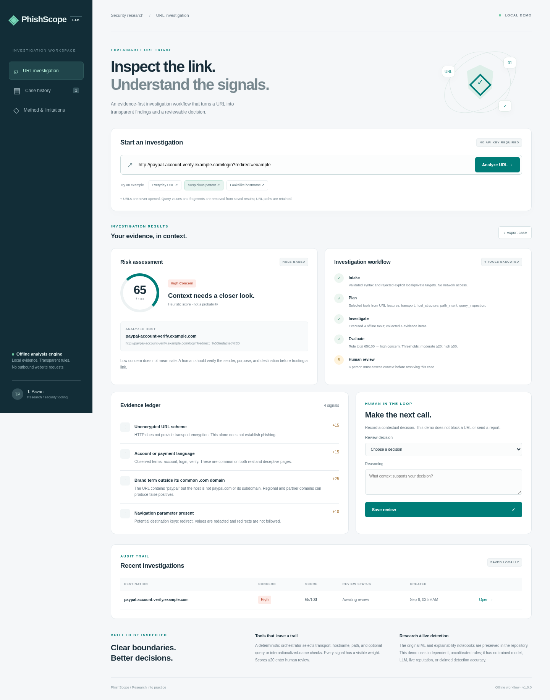
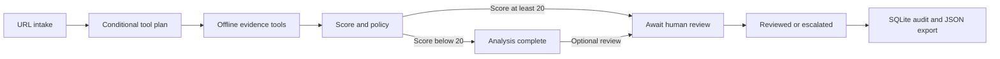

# PhishScope · Phishing Detection

A runnable URL investigation workspace alongside the original phishing-detection research notebooks. The demo uses **transparent offline rules**, a tool-selecting workflow, an evidence ledger, and a persisted human-review decision.

**This demo does not load the notebook models, use an LLM, or claim their accuracy.** Its score is an uncalibrated rule total, not a probability or a guarantee that a URL is safe.



## Run the demo

```bash
docker compose up -d --build
# Open http://localhost:3102
```

The service restarts automatically with Docker and saves cases in the `phishscope-data` named volume. It binds to `127.0.0.1` on the host. The container runs as a non-root user with a read-only root filesystem. Check `docker compose ps` for health. Stop with `docker compose down`; this preserves saved cases.

Or use Python 3.10+ with no runtime dependencies:

```bash
python3 -m app.server
```

Configuration: `HOST` (default `127.0.0.1`), `PORT` (default `3102`), and `DATA_DIR` (default `data`). No API key, model download, or account is needed. Optional Node dependencies are used only for browser tests.

## Explore the workflow

1. Choose an example or enter an HTTP(S) URL.
2. **Intake** validates syntax, rejects explicit private/local addresses and embedded credentials, and removes query values and fragments from saved results.
3. **Plan** selects transport, hostname, and path checks; query and internationalized-hostname checks run only when relevant.
4. **Investigate** collects explanations with visible weights. **Evaluate** sums the evidence, capped at 100: low `<20`, moderate `20–49`, high `≥50`.
5. Moderate/high concern pauses at **Human review**. An operator records a decision and reasoning. Low-concern cases can also be reviewed. Decisions are persisted once; further investigation is an explicit escalation state.
6. Open the case again from history or export its JSON audit record.

The agent-style architecture is **deterministic orchestration**, not an autonomous LLM agent. It performs actual conditional checks and state transitions; there are no simulated model calls or fabricated threat-intelligence results.



## Boundaries and data handling

- Submitted websites are **never fetched**, resolved through DNS, rendered, or executed. No live reputation, certificates, page content, or redirects are checked.
- Explicit private, reserved, multicast, loopback, local-hostname, and ambiguous numeric targets are rejected. Public-looking hostnames are not resolved, so the demo does not establish whether their DNS points to a public address. There is no URL-fetching path that could use them for SSRF.
- Query **values** and fragments are removed before persistence; hostname, path, query names, evidence, and review notes remain in the local database. Do not submit sensitive paths or notes. HTTP request logging is disabled.
- HTTPS, brand terms, Unicode names, long URLs, and login language can appear on legitimate and malicious sites. These rules have false positives and false negatives and have not been evaluated as a production classifier.
- This is a single-operator local demonstration. Reviewer identity is labeled “local demo operator”; it is not authenticated or a tamper-proof audit. Public deployment requires authentication, storage access controls, rate limits, and a production HTTP server.
- No live blocking, reporting, email sending, or automated remediation occurs.

## API

| Method | Path | Purpose |
| --- | --- | --- |
| GET | `/api/health` | Version, mode, health |
| POST | `/api/analyze` | `{"url":"https://example.com"}` creates a case |
| GET | `/api/cases` | Latest 30 cases |
| GET | `/api/cases/{id}` | Full case evidence and state |
| POST | `/api/cases/{id}/review` | `{"decision":"suspicious","note":"Reasoning"}` records one review |

Review decisions: `likely_legitimate`, `suspicious`, `needs_investigation`. Notes are required and limited to 500 characters; duplicate reviews return HTTP 409. The browser exports the case response as JSON.

## Verification

```bash
python3 -m unittest discover -s tests -v
# With the app running on localhost:3102:
npm ci
npx playwright install chromium
npm run test:e2e
```

Eight unit/integration tests cover no-network analysis, private and ambiguous targets, credential rejection, redaction, conditional tools, scoring, persisted reviews, escalation, invalid payloads, cross-origin requests, and response security headers. Browser checks exercise high/low results, the five-stage trail, review persistence after reload, JSON export, rejected private input, mobile overflow, and JavaScript errors. See [validation record](docs/VALIDATION.md) and [mobile screenshot](docs/demo-mobile.png). CI runs both suites; local results do not imply a completed remote CI run.

## Original research

The root notebooks are preserved unchanged: EDA, classical classifiers, URL embeddings, neural networks, and Captum/SHAP/LIME explainability. The original project description is archived in [docs/RESEARCH.md](docs/RESEARCH.md). Any research results belong to the original experimental setup and are not measurements of this web demo. Trained weights, reproducible datasets, and an inference contract would be required before connecting those models to the app.
